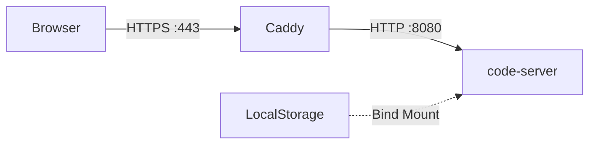

# Docker Usage Guide

This repository establishes a secure **VS Code** environment using two containers:

1. **App**: `codercom/code-server` (VS Code in the browser)
2. **Proxy**: `caddy` (TLS termination and Basic Auth)

## Quick Start

```bash
# 1. Start everything
docker compose -f docker/docker-compose.yml up --build

# 2. Access
# https://localhost
# Accept the self-signed certificate warning (localhost only)
```

## Architecture



### Networking

- **Locally**: `docker/docker-compose.yml` runs two services. Caddy proxies to `app:8080`.
- **Azure ACI**: Both containers run in the **same container group** (pod). Caddy proxies to `localhost:8080`.

## Configuration

### Basic Auth

For local development, the password hash is defined in `.env`.
To generate a new hash:

```bash
docker run --rm caddy:2-alpine caddy hash-password --plaintext 'your-password'
```

### VS Code Extensions

Extensions are pre-installed in `docker/Dockerfile`:

```dockerfile
RUN code-server --install-extension rooveterinaryinc.roo-cline
```

To add more, edit the Dockerfile and rebuild:

```bash
docker compose -f docker/docker-compose.yml build
```

## Troubleshooting

### "502 Bad Gateway"

This means Caddy cannot reach code-server.

1. Check if `app` container is running:
   ```bash
   docker compose -f docker/docker-compose.yml ps
   ```

2. Check logs:
   ```bash
   docker compose -f docker/docker-compose.yml logs app
   ```

### Permission Issues

The `code-server` container runs as user `coder` (UID 1000).
If you mount a host directory, ensure your host user has ID 1000 or the files are writable by others.

```yaml
# docker/docker-compose.yml
services:
  app:
    volumes:
         - ../workspace:/home/coder/workspace
```
