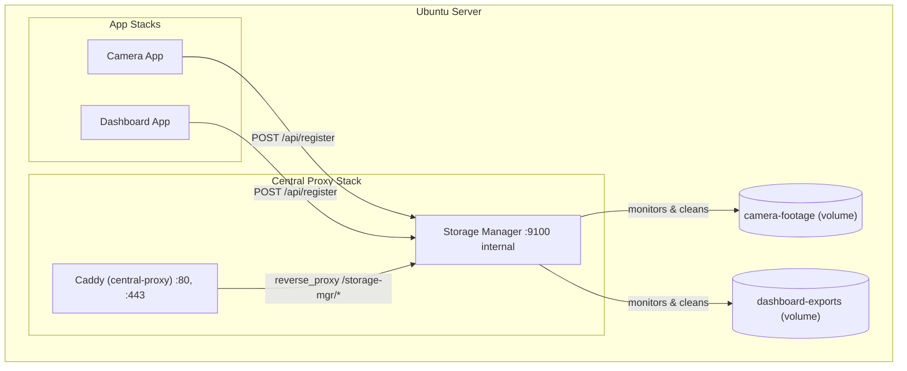

# Storage Manager Service

## Related Plans

- Deploy customization hooks: `planning/deploy-customization-hooks.md`

A lightweight, container-native storage manager that runs alongside the centralized Caddy proxy on Ubuntu servers. App containers *register* specific directories or files within volumes for monitoring; the manager applies pluggable cleanup algorithms to keep disk usage under control.

## Problem

Long-running containers (cameras, loggers, dashboards) write to Docker volumes that grow indefinitely. Today there is no automated way to cap or prune those volumes — operators must SSH in and clean up manually or rely on app-level logic that is easy to forget.

## Goals

1. **Zero-touch cleanup** — once a path is registered, the manager handles it.
2. **Fine-grained targets** — register specific directories or files within a volume (e.g. `/recordings` vs `/snapshots`), each with its own algorithm and params.
3. **Pluggable algorithms** — different paths may need different strategies (e.g. cameras want "max size, delete oldest", logs want "delete older than N days").
4. **Docker-native** — runs as a service in the centralized proxy stack; no host agents or cron jobs required.
5. **Self-service registration** — app containers register via a simple REST API or compose labels; no manual Caddyfile-style editing.
6. **Observable** — exposes a health/status endpoint so Portainer dashboards and alerting can integrate.

---

## Architecture



### Key design decisions

| Decision | Choice | Rationale |
|----------|--------|-----------|
| Language | **Python** | Aligns with project conventions (PEP 8, pytest, logging prefixes). |
| Framework | **Flask** (lightweight) | Consistent with the existing stock-dashboard backend. |
| Scheduling | **APScheduler** | In-process, no external cron dependency. |
| Registration | **REST API + Docker compose labels** | API for runtime registration; labels for static/boot-time discovery via Docker socket. |
| Storage | **SQLite** (single-file, in a volume) | Persists registrations across restarts; no external DB needed. |
| Docker socket | **Read-only bind mount** | Needed for label-based auto-discovery and `docker system df` metrics. |

---

## Registration API

Registrations target a **specific path** (directory or file) inside a Docker volume. Multiple registrations can exist for the same volume with different paths and algorithms.

### `POST /api/register`

Register a directory or file within a volume for monitoring.

```json
{
  "volume_name": "camera-footage",
  "path": "/recordings",
  "algorithm": "max_size",
  "params": {
    "max_bytes": 5368709120,
    "sort_by": "mtime"
  },
  "description": "Security camera recordings"
}
```

- `volume_name` — the Docker volume name.
- `path` — directory or file path **relative to the volume root**. Use `/` to target the entire volume.
- `algorithm` — the cleanup strategy to apply (see [Cleanup Algorithms](#cleanup-algorithms) for available options).
- `params` — algorithm-specific configuration. Common params:
  - `sort_by` — determines the order in which files are evaluated for deletion. Accepted values:
    - `mtime` — sort by **last-modified time** (oldest modified first). Best default for recordings, logs, and most time-series data.
    - `ctime` — sort by **metadata change time** (oldest created/moved first). Useful when files are written once and never updated.
    - `size` — sort by **file size** (largest first). Useful when a few large files dominate disk usage.
- `description` — optional human-readable label shown in the status UI.
- Multiple registrations per volume are allowed (e.g. different rules for `/recordings` and `/snapshots`).

### `DELETE /api/register/{volume_name}/{path}`

Unregister a specific path within a volume. The `path` component is URL-encoded (e.g. `/api/register/camera-footage/%2Frecordings`).

### `GET /api/volumes`


List **all** Docker volumes on the host (discovered via the Docker SDK), enriched with registration and cleanup info where available. This gives operators a complete view of disk usage — not just the volumes they have registered.

```json
[
  {
    "volume_name": "camera-footage",
    "current_bytes": 4294967296,
    "containers": ["camera-app"],
    "driver": "local",
    "created_at": "2026-01-15T08:30:00Z",
    "registrations": [
      {
        "path": "/recordings",
        "algorithm": "max_size",
        "params": { "max_bytes": 5368709120, "sort_by": "mtime" },
        "path_bytes": 3221225472,
        "last_cleaned": "2026-02-24T10:00:00Z",
        "files_removed_last_run": 12
      },
      {
        "path": "/snapshots",
        "algorithm": "keep_n_latest",
        "params": { "keep_count": 100 },
        "path_bytes": 1073741824,
        "last_cleaned": "2026-02-24T09:55:00Z",
        "files_removed_last_run": 5
      }
    ]
  },
  {
    "volume_name": "caddy_data",
    "current_bytes": 1048576,
    "containers": ["caddy"],
    "driver": "local",
    "created_at": "2026-01-10T12:00:00Z",
    "registrations": []
  }
]
```

Query parameters:

| Param | Default | Description |
|-------|---------|-------------|
| `name` | *(none)* | Filter by volume name (substring match, case-insensitive). |
| `registered` | *(all)* | Filter: `true` = only registered, `false` = only unregistered. |
| `sort` | `volume_name` | Sort by `volume_name`, `current_bytes`, or `created_at`. |

### `GET /api/health`

Returns `200 OK` with scheduler status and per-volume health.

### Compose-label auto-discovery (alternative)

App containers can declare monitoring via compose labels instead of calling the API. Use a numeric index to register multiple paths per container:

```yaml
services:
  camera-app:
    labels:
      storage-manager.0.volume: "camera-footage"
      storage-manager.0.path: "/recordings"
      storage-manager.0.algorithm: "max_size"
      storage-manager.0.max_bytes: "5368709120"
      storage-manager.0.sort_by: "mtime"
      storage-manager.1.volume: "camera-footage"
      storage-manager.1.path: "/snapshots"
      storage-manager.1.algorithm: "keep_n_latest"
      storage-manager.1.keep_count: "100"
```

The storage manager polls the Docker socket on startup and at regular intervals to discover new labels.

---

## Cleanup Algorithms

All algorithms implement a common interface:

```python
class CleanupAlgorithm(ABC):
    """Base class for cleanup strategies."""

    @abstractmethod
    def should_clean(self, target_path: str, params: dict) -> bool:
        """Return True if the target path needs cleaning."""

    @abstractmethod
    def clean(self, target_path: str, params: dict) -> CleanupResult:
        """Execute cleanup on target_path and return result summary."""
```

### Built-in algorithms

| Algorithm | Key | Params | Behaviour |
|-----------|-----|--------|-----------|
| **Max Size** | `max_size` | `max_bytes`, `sort_by` (`mtime` / `ctime` / `size`) | Deletes oldest/largest files until total size ≤ `max_bytes`. |
| **Remove Before Date** | `remove_before_date` | `before_date` (ISO 8601) or `max_age_days` | Removes all files older than threshold. |
| **Keep N Latest** | `keep_n_latest` | `keep_count`, `sort_by` | Keeps only the N most recent files; removes the rest. |

New algorithms are added by subclassing `CleanupAlgorithm` and registering them in an algorithm registry dict — no framework changes needed.

---

## File Organization

Following `AGENT.md` conventions:

```
docker/
  storage-manager/
    Dockerfile                     # Python slim image, installs deps
    docker-compose.yml             # Joins caddy network, mounts volumes
    requirements.txt               # flask, apscheduler, docker (SDK)
    src/
      app.py                       # Flask app + APScheduler bootstrap
      api.py                       # REST endpoints (/api/register, etc.)
      models.py                    # SQLite models (registered volumes)
      scheduler.py                 # Cleanup job runner
      algorithms/
        __init__.py                # Algorithm registry
        base.py                    # CleanupAlgorithm ABC
        max_size.py                # Max-size algorithm
        remove_before_date.py      # Date-threshold algorithm
        keep_n_latest.py           # Keep-N algorithm
      discovery.py                 # Docker-label auto-discovery
    tests/
      test_algorithms.py           # Unit tests for each algorithm
      test_api.py                  # API endpoint tests
      test_discovery.py            # Label discovery tests
      test_scheduler.py            # Scheduler integration tests
docs/
  deploy/
    STORAGE_MANAGER.md             # User-facing documentation
planning/
  STORAGE_MANAGER.md               # This file
```

---

## Docker Integration

### `docker/storage-manager/docker-compose.yml` 

```yaml
services:
  storage-manager:
    build:
      context: .
      dockerfile: Dockerfile
    container_name: storage-manager
    restart: unless-stopped
    environment:
      SM_CHECK_INTERVAL_SECONDS: ${SM_CHECK_INTERVAL_SECONDS:-300}
      SM_LOG_LEVEL: ${SM_LOG_LEVEL:-INFO}
      SM_DB_PATH: /data/storage_manager.db
    volumes:
      # Persist registrations
      - sm_data:/data
      # Read-only Docker socket for label discovery
      - /var/run/docker.sock:/var/run/docker.sock:ro
    expose:
      - "9100"
    networks:
      - caddy

networks:
  caddy:
    external: true
    name: caddy

volumes:
  sm_data:
```

App volumes that need monitoring are bind-mounted or named-volume–mounted into the storage manager at registration time. The manager resolves Docker volume mount paths via the Docker SDK.

### Caddy registration

Add a route block to `docker/proxy/Caddyfile` so the manager UI/API is accessible (optionally behind basic auth):

```caddy
# -------------------------
# Storage Manager Route
# -------------------------
storage.zenia.eu {
    tls {$ACME_EMAIL}
    header Strict-Transport-Security "max-age=31536000; includeSubDomains; preload"
    
    basic_auth /* {
        {$BASIC_AUTH_USER} {$BASIC_AUTH_HASH}
    }
    
    reverse_proxy storage-manager:9100
}
```

---

## Environment Variables

| Variable | Default | Description |
|----------|---------|-------------|
| `SM_CHECK_INTERVAL_SECONDS` | `300` | How often the scheduler runs cleanup checks. |
| `SM_LOG_LEVEL` | `INFO` | Logging verbosity (`DEBUG`, `INFO`, `WARNING`, `ERROR`). |
| `SM_DB_PATH` | `/data/storage_manager.db` | Path to SQLite database inside the container. |
| `SM_API_PORT` | `9100` | Port the Flask API listens on. |

During Phase 4, add these variables to the project's `.env.example` with their default values pre-filled:

```env
# Storage Manager
SM_CHECK_INTERVAL_SECONDS=300
SM_LOG_LEVEL=INFO
SM_DB_PATH=/data/storage_manager.db
SM_API_PORT=9100
```
---

## Daily Log Rotation

Containers in this repo write logs to **daily rotating files** inside a shared `logs` volume. This makes log management a first-class use case for the storage manager.

### How it works

1. **Entrypoint** (`ubuntu_start.sh` or equivalent) exports `LOG_DATE` as a shell environment variable before launching supervisord:

   ```bash
   export LOG_DATE=$(date +%Y-%m-%d)
   exec /usr/bin/supervisord -c /etc/supervisor/conf.d/supervisord.conf
   ```

2. **Supervisord** references this variable via its `%(ENV_LOG_DATE)s` syntax (supervisord's way of reading environment variables — `%(ENV_X)s` reads the environment variable `X`). This directs stdout/stderr to daily-rotating files:

   ```ini
   [program:code-server]
   stdout_logfile=/app/logs/code-server-stdout-%(ENV_LOG_DATE)s.log
   stdout_logfile_maxbytes=0
   stderr_logfile=/app/logs/code-server-stderr-%(ENV_LOG_DATE)s.log
   stderr_logfile_maxbytes=0
   ```

   > **Note:** `LOG_DATE` is set once at container start, so files rotate per container restart. For true midnight rotation, a cron job or wrapper script can re-export `LOG_DATE` and `supervisorctl restart` the program.

### Log files produced

```
/app/logs/
  code-server-stdout-2026-02-24.log
  code-server-stderr-2026-02-24.log
  code-server-stdout-2026-02-23.log
  ...
```

### Storage Manager integration (usage example)

The recommended way to register volumes is via **compose labels** directly in the app's `docker-compose.yml` — this keeps registration co-located with the volume definition and requires no separate API call:

```yaml
services:
  app:
    volumes:
      - logs:/app/logs
    labels:
      storage-manager.0.volume: "protected-container_logs"
      storage-manager.0.path: "/"
      storage-manager.0.algorithm: "remove_before_date"
      storage-manager.0.max_age_days: "14"
      storage-manager.0.description: "Rotate code-server logs, keep last 14 days"
```

    Registrations should be defined via compose labels, and `ubuntu_deploy.py` should automatically process and apply all storage registrations during deployment.

Alternatively, registrations can be created at runtime via the REST API:

```json
{
  "volume_name": "protected-container_logs",
  "path": "/",
  "algorithm": "remove_before_date",
  "params": { "max_age_days": 14 },
  "description": "Rotate code-server logs, keep last 14 days"
}
```

---

## Task Checklist

### Phase 0 — Cleanup & Prep
- [ ] Review existing `docker/` structure for conflicts or reusable patterns.
- [ ] Ensure no file naming collisions with existing services.

### Phase 1 — Core Service Scaffold
- [ ] Create `docker/storage-manager/` directory structure.
- [ ] Implement `CleanupAlgorithm` ABC and algorithm registry.
- [ ] Implement `max_size` algorithm.
- [ ] Implement `remove_before_date` algorithm.
- [ ] Implement `keep_n_latest` algorithm.
- [ ] Add pytest unit tests for all three algorithms.

### Phase 1.5 — Daily Log Rotation
- [ ] Update `docker/supervisord.conf` to write daily log files to `/app/logs/`.
- [ ] Update entrypoint script to set `LOG_DATE` and handle midnight rotation.
- [ ] Ensure `logs` volume is declared in `docker-compose.yml`.
- [ ] Add compose labels on the app container to auto-register logs with the storage manager.

### Phase 2 — API & Persistence
- [ ] Implement SQLite models for volume registrations.
- [ ] Implement Flask REST API (`/api/register`, `/api/volumes`, `/api/health`).
- [ ] Implement APScheduler integration to run cleanup jobs.
- [ ] Add pytest tests for API endpoints.

### Phase 3 — Docker Label Discovery
- [ ] Implement Docker socket label scanner.
- [ ] Add periodic re-scan for newly started containers.
- [ ] Add pytest tests for discovery logic (mocked Docker SDK).

### Phase 4 — Ubuntu Deploy Registration Automation
- [ ] Integrate storage label registration flow into `scripts/deploy/ubuntu_deploy.py`.
- [ ] Wire compose-label registrations so deployment automatically registers all declared storage targets.
- [ ] Add/extend tests to verify deployment-driven registration execution.

Cross-reference: implement this phase through the hook model in `planning/deploy-customization-hooks.md` to keep `ubuntu_deploy.py` upstream-friendly.

### Phase 5 — Docker & Proxy Integration
- [ ] Create `docker/storage-manager/Dockerfile`.
- [ ] Create `docker/storage-manager/docker-compose.yml`.
- [ ] Add Caddy route block to `docker/proxy/Caddyfile`.
- [ ] Add storage manager variables to `.env.example` with default values pre-filled.
- [ ] Validate compose config (`docker compose config`).

### Phase 6 — Documentation
- [ ] Create `docs/deploy/STORAGE_MANAGER.md` with setup and usage guide.
- [ ] Update `README.md` with storage manager section.

### Phase 7 — Verification
- [ ] Run full pytest suite.
- [ ] `docker compose build` the storage-manager image.
- [ ] `docker compose up` and verify health endpoint.
- [ ] Manual test: register a volume via API, add test files, verify cleanup runs.

---

## Phase Exit Criteria

| Phase | Exit Criteria |
|-------|---------------|
| 0 | No naming conflicts; directory structure planned. |
| 1 | All algorithms pass unit tests with edge cases (empty volume, exactly-at-limit, single file). |
| 2 | API returns correct JSON; registrations persist across restart (SQLite). |
| 3 | Label discovery finds test containers; ignores containers without labels. |
| 4 | `ubuntu_deploy.py` auto-processes compose storage labels and applies registrations during deploy. |
| 5 | `docker compose -f docker/storage-manager/docker-compose.yml config` validates; image builds. |
| 6 | Docs are linked from README; user can follow guide end-to-end. |
| 7 | All automated tests green; manual smoke test passes. |

---

## Verification Plan

### Automated Tests

```bash
# Run all storage manager tests
source .venv/bin/activate && pytest docker/storage-manager/tests/ -v

# Run full project test suite to check for regressions
source .venv/bin/activate && pytest tests/pytests/ -v
```

### Manual Verification

1. **Build**: `docker compose -f docker/storage-manager/docker-compose.yml build`
2. **Start**: `docker compose -f docker/storage-manager/docker-compose.yml up -d`
3. **Health check**: `curl http://localhost:9100/api/health`
4. **Register a test path**: `curl -X POST http://localhost:9100/api/register -H 'Content-Type: application/json' -d '{"volume_name":"test-vol","path":"/data","algorithm":"max_size","params":{"max_bytes":1048576}}'`
5. **List volumes**: `curl http://localhost:9100/api/volumes`
6. **Verify in Portainer**: confirm `storage-manager` container is running and healthy.
